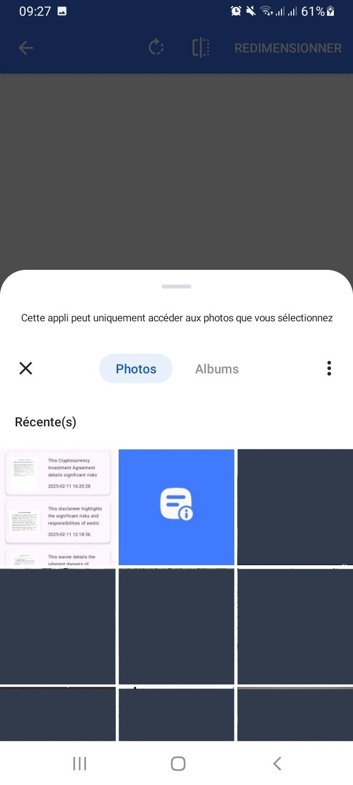

<p align="center">

</p>

# TermScan Guardian

- Your vigilant ally in navigating terms and conditions. Scan, detect, and protect against dubious clauses with ease.
---

# 📸 Screenshots
<p align="center">


</p>
<p align="center">



</p>
<p align="center">


</p>
<p align="center">


</p>
<p align="center">

</p>

---

# 🛠 Tech Stack
- **Programming Language**: Kotlin
- **UI Framework**: Jetpack Compose
- **Networking**: OkHttp
- **Data Storage**: Room Database
- **Navigation**: Jetpack Navigation for Compose
- **Concurrency**: Kotlin Coroutines
- **Architecture**: MVVM (Model-View-ViewModel)
- **Machine Learning**: Google Play Services Vision
- **Generative AI**: Gemini
- **Build Tools**: Gradle (KSP for annotation processing)

---

# 🚀 Installation & Setup

Follow these steps to set up and run TermScan Guardian locally.

## 📱 Android App Setup
1️⃣ Clone the Repository
```
git clone https://github.com/MedTahiri/TermScan-Guardian.git
cd TermScan-Guardian
```
2️⃣ Open in Android Studio

Open Android Studio and select the android directory.

3️⃣ Configure API
- update local.properties
```
API_KEY=YOUR_API
```

4️⃣ Build & Run

Click Run ▶️ in Android Studio to launch the app on an emulator or device.

Now your TermScan Guardian app is ready to use! 🎉

---

# 🤝 Contributing
We welcome contributions from the community! If you'd like to contribute to TermScan Guardian, please follow these steps:

1️⃣ Fork the Repository

- Fork the project to your GitHub account.

2️⃣ Clone the Forked Repository

```
git clone https://github.com/your-username/TermScan-Guardian.git
cd TermScan-Guardian
```

3️⃣ Create a New Branch
```
git checkout -b feature/your-feature-name
```

4️⃣ Make Your Changes
- Follow the coding guidelines and ensure your code is well-documented.

5️⃣ Commit Your Changes

- Write clear and concise commit messages.
```
git commit -m "Add: Your feature description"
```

6️⃣ Push to Your Branch
```
git push origin feature/your-feature-name
```

7️⃣ Open a Pull Request
- Go to the original repository and open a pull request.

- Provide a detailed description of your changes.

---

<p align="center">
Thank you for using TermScan Guardian! 🚀
</p>